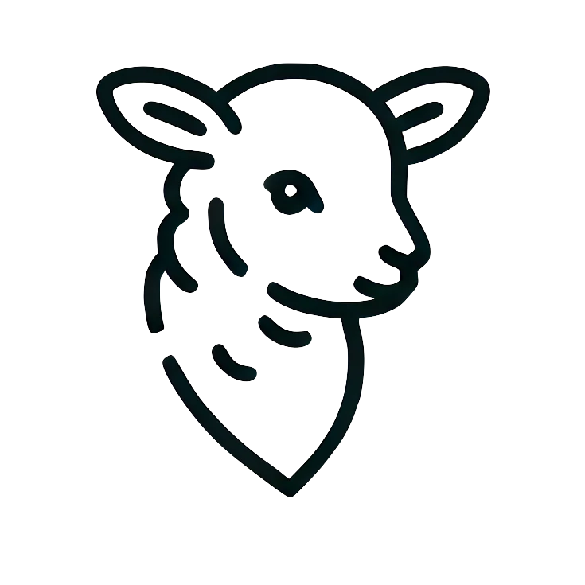

<div align="center">
<a href="https://boundaryml.com?utm_source=github" target="_blank" rel="noopener noreferrer">
  <picture>
    <source media="(prefers-color-scheme: dark)" srcset="fern/assets/baml-lamb-white.png">
    
  </picture>
</a>
</div>

<div align="center">

## BAML: Basically a Made-up Language

*or "Basic-Ass Machine Learning" if your boss isn't around*


<h3>

[Homepage](https://www.boundaryml.com/) | [Docs](https://docs.boundaryml.com) | [BAML Chat](https://www.boundaryml.com/chat) | [Discord](https://discord.gg/BTNBeXGuaS)

</h3>

[](https://github.com/boundaryml/baml)
[](https://opensource.org/licenses/Apache-2)
[](https://pypi.org/project/baml-py/)


**Try BAML**: [Prompt Fiddle](https://www.promptfiddle.com) • [Examples](https://baml-examples.vercel.app/) • [Example Source Code](https://github.com/BoundaryML/baml-examples)

**5 minute quickstarts**
[Python](https://docs.boundaryml.com/guide/installation-language/python) • [Typescript](https://docs.boundaryml.com/guide/installation-language/typescript) • [NextJS](https://docs.boundaryml.com/guide/installation-language/next-js) • [Ruby](https://docs.boundaryml.com/guide/installation-language/ruby) • [Others](https://docs.boundaryml.com/guide/installation-language/rest-api-other-languages) (Go, Java, C++, Rust, PHP, etc)

</div>

|   |     |
| - | - |
| What is BAML? | BAML is a new programming language for builing AI applications. |
| Do I need to write my whole app in BAML? | Nope, only the AI parts, you can then use BAML with any existing language of your choice! [python](/python), [typescript](/ts), and [more](/more). |
| Is BAML stable? | Yes, many companies use it in production! We ship updates weekly and rarely have breaking changes |
| Why a new language? | [Jump to section](#why-a-new-programming-language) |
| Why a lamb? | Baaaaa-ml. LAMB == BAML |


## The core BAML principle: LLM Prompts are functions

The fundamental building block in BAML is a function. Every prompt is a function that takes in parameters and returns a type.

```baml
function ChatAgent(message: Message[], tone: "happy" | "sad") -> string
```

Every function additionally defines which models it uses and what its prompt is.

```baml
function ChatAgent(message: Message[], tone: "happy" | "sad") -> StopTool | ReplyTool {
    client "openai/gpt-4o-mini"

    prompt #"
        Be a {{ tone }} bot.

        {{ ctx.output_format }}

        
        {{ _.role(m.role) }}
        {{ m.content }}
        
    "#
}

class Message {
    role string
    content string
}

class ReplyTool {
  response string
}

class StopTool {
  action "stop" @description(#"
    when it might be a good time to end the conversation
  "#)
}
```

Then in any language of your choice you can do the following:

```python
from baml_client import b
from baml_client.types import Message, StopTool

messages = [Message(role="assistant", content="How can I help?")]

while True:
  print(messages[-1].content)
  user_reply = input()
  messages.append(Message(role="user", content=user_reply))
  tool = b.ChatAgent(messages, "happy")
  if isinstance(tool, StopTool):
    print("Goodbye!")
    break
  else:
    messages.append(Message(role="assistant", content=tool.reply))
```

### Making prompts easy to find and read

Since every prompt is a function, we can build tools to find every prompt you've written. But we've taken BAML one step further and built native tooling for VSCode (jetbrains + neovim coming soon).

1. You can see the full prompt (including any multi-modal assets)

2. You can see the exact network request we are making

3. You can see every function you've ever written


### Swapping models: 1-line change

It's just 1 line (ok, maybe 2). [Docs](https://docs.boundaryml.com/guide/baml-basics/switching-llms)


[Retry policies](https://docs.boundaryml.com/ref/llm-client-strategies/retry-policy) • [fallbacks](https://docs.boundaryml.com/ref/llm-client-strategies/fallback) • [model rotations](https://docs.boundaryml.com/ref/llm-client-strategies/round-robin). All statically defined.


> Want to do pick models at runtime? Check out [Client Registry](https://docs.boundaryml.com/guide/baml-advanced/llm-client-registry).

We currently support: [OpenAI](https://docs.boundaryml.com/ref/llm-client-providers/open-ai) • [Anthropic](https://docs.boundaryml.com/ref/llm-client-providers/anthropic) • [Gemini](https://docs.boundaryml.com/ref/llm-client-providers/google-ai-gemini) • [Vertex](https://docs.boundaryml.com/ref/llm-client-providers/google-vertex) • [Bedrock](https://docs.boundaryml.com/ref/llm-client-providers/aws-bedrock) • [Azure OpenAI](https://docs.boundaryml.com/ref/llm-client-providers/open-ai-from-azure) • [Anything OpenAI Compatible](https://docs.boundaryml.com/ref/llm-client-providers/openai-generic) ([Ollama](https://docs.boundaryml.com/ref/llm-client-providers/openai-generic-ollama), [OpenRouter](https://docs.boundaryml.com/ref/llm-client-providers/openai-generic-open-router), [VLLM](https://docs.boundaryml.com/ref/llm-client-providers/openai-generic-v-llm), [LMStudio](https://docs.boundaryml.com/ref/llm-client-providers/openai-generic-lm-studio), [TogetherAI](https://docs.boundaryml.com/ref/llm-client-providers/openai-generic-together-ai), and more)

### Hot-reloading for prompts

Using AI is all about iteration speed.

If testing your pipeline takes 2 minutes, in 20 minutes, you can only test 10 ideas.

If testing your pipeline took 5 seconds, in 20 minutes, you can test 240 ideas.

Introducing testing, for prompts.


### Structured outputs with any LLM

JSON is amazing for REST APIs, but way too strict and verbose for LLMs. LLMs need something flexible. We created the SAP (schema-aligned parsing) algorithm to support the flexible outputs LLMs can provide, like markdown within a JSON blob or chain-of-thought prior to answering.


SAP works with any model on day-1, without depending on tool-use or function-calling APIs.

To learn more about SAP you can read this post: [Schema-Aligned Parsing](https://www.boundaryml.com/blog/schema-aligned-parsing).

See it in action with: [Deepseek-R1](https://www.boundaryml.com/blog/deepseek-r1-function-calling) and [OpenAI O1](https://www.boundaryml.com/blog/openai-o1).

### Streaming (when it's a first class citizen)

Streaming is way harder than it should be. With our [Python/Typescript/Ruby] generated code, streaming becomes natural and type-safe.


### No strings attached

- 100% open-source (Apache 2)
- 100% private. AGI will not require an internet connection, neither will BAML
    - No network requests beyond model calls you explicitly set
    - Not stored or used for any training data
- BAML files can be saved locally on your machine and checked into Github for easy diffs.
- Built in Rust. So fast, you can't even tell it's there.

## BAML's Design Philosophy

Everything is fair game when making new syntax. If you can code it, it can be yours. This is our design philosophy to help restrict ideas:

- **1:** Avoid invention when possible
    - Yes, prompts need versioning — we have a great versioning tool: git
    - Yes, you need to save prompts — we have a great storage tool: filesystems
- **2:** Any file editor and any terminal should be enough to use it
- **3:** Be fast
- **4:** A first year university student should be able to understand it

## Why a new programming language

We used to write websites like this:

```python
def home():
    return "<button onclick=\"() => alert(\\\"hello!\\\")\">Click</button>"
```

And now we do this:

```jsx
function Home() {
  return <button onClick={() => setCount(prev => prev + 1)}>
          {count} clicks!
         </button>
}
```

New syntax can be incredible at expressing new ideas. Plus the idea of maintaining hundreds of f-strings for prompts kind of disgusts us 🤮. Strings are bad for maintainable codebases. We prefer structured strings.

The goal of BAML is to give you the expressiveness of English, but the structure of code.

Full [blog post](https://www.boundaryml.com/blog/ai-agents-need-new-syntax) by us.


## Conclusion

As models get better, we'll continue expecting even more out of them. But what will never change is that we'll want a way to write maintainable code that uses those models. The current way we all just assemble strings is very reminiscent of the early days PHP/HTML soup in web development. We hope some of the ideas we shared today can make a tiny dent in helping us all shape the way we all code tomorrow.


## Contributing
Checkout our [guide on getting started](/CONTRIBUTING.md)

---

Made with ❤️ by Boundary

HQ in Seattle, WA

P.S. We're hiring for software engineers that love rust. [Email us](founders@boundaryml.com) or reach out on [discord](https://discord.gg/ENtBB6kkXH)!

<div align="left" style="align-items: left;">
        <a href="#top">
            
        </a>
</div>


